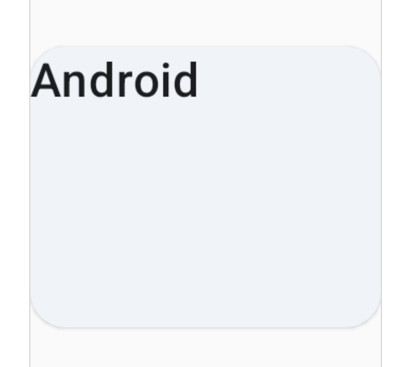
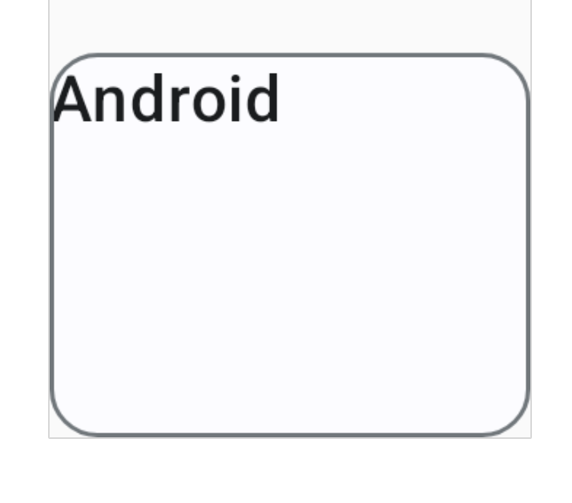
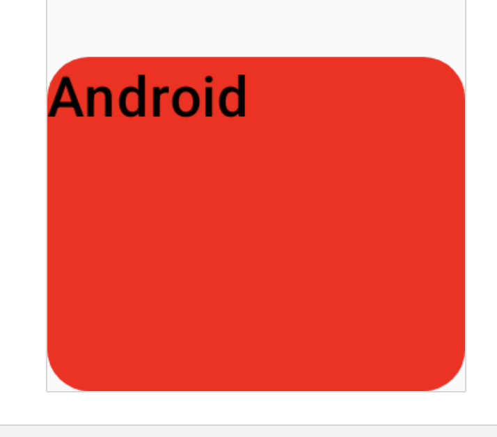

# Jetpack Compose : Card のバリエーション

https://developer.android.com/jetpack/compose/components/card

## Card

```kotlin
Card(modifier = Modifier.size(width = 120.dp, height = 96.dp)) {
    Text(text = name, style = MaterialTheme.typography.titleMedium)
}
```


## ElevatedCard

影がついている Card。 elevation で浮き上がり具合を変更できる。

```kotlin
ElevatedCard(modifier =Modifier.size(width = 120dp, height = 96.dp)) {
    Text(text = name, style = MaterialTheme.typography.titleMedium)
}
```



## OutlinedCard

枠線で囲まれた Card。

```kotlin
OutlinedCard(modifier =Modifier.size(width = 120dp, height = 96.dp)) {
    Text(text = name, style = MaterialTheme.typography.titleMedium)
}
```



## 背景色を変えるには

`colors` 引数で色指定ができる。`CardColors` の `containerColor` が背景。

```kotlin
Card(
    colors = CardDefaults.cardColors(
        containerColor = Color.Red,
    ),
    modifier = Modifier.size(width = 120.dp, height = 96.dp)
) {
    Text(text = name, style = MaterialTheme.typography.titleMedium)
}
```



`Card` の引数の与え方で `ElevatedCard` も `OutlinedCard` も 実現できるが、定義されているComposable は disabled 時の色の変化などもサポートされているので、使っておけば見た目上おかしなことにはならない。
