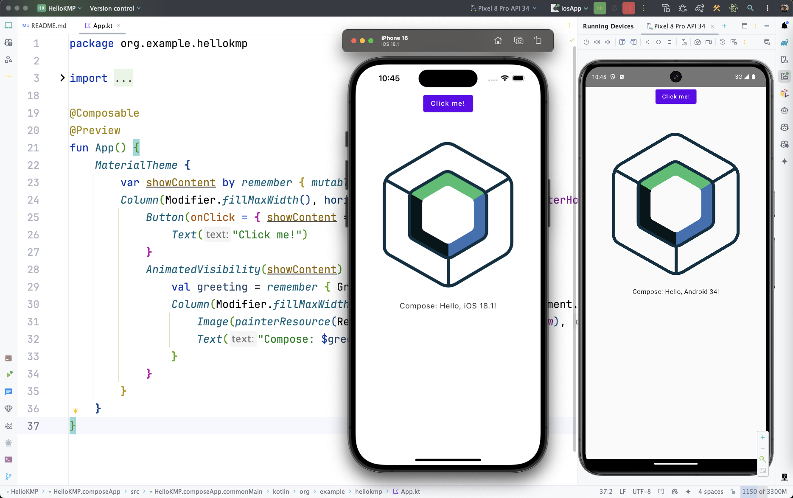

# Kotlin Multiplatform Mobile

[Multiplatform : The Kotlin Blog \| JetBrains のブログ](https://blog.jetbrains.com/ja/kotlin/category/multiplatform/)

## How to Start

Android Studioの新規作成でもプロジェクトを作ることはできるが、 JetBrainsのチュートリアルは Kotlin Multiplatform Wizard で作られたプロジェクトを前提にしている。 Compose Multiplatform も導入されているのでそちらのほうが楽。そのうちいい感じに統合されるだろう。

1. [Kotlin Multiplatform Wizard](https://kmp.jetbrains.com/) でプロジェクトを作成してダウンロード。
2. ダウンロードしたプロジェクトを Android Studioで開く

